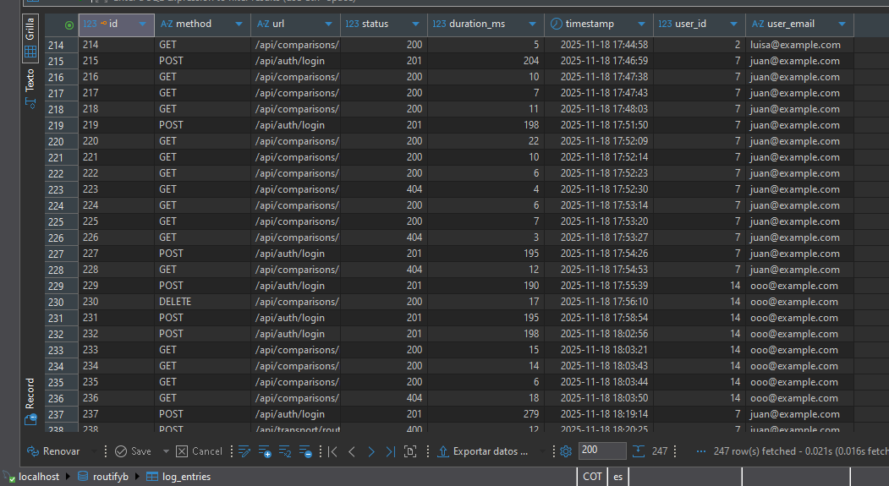
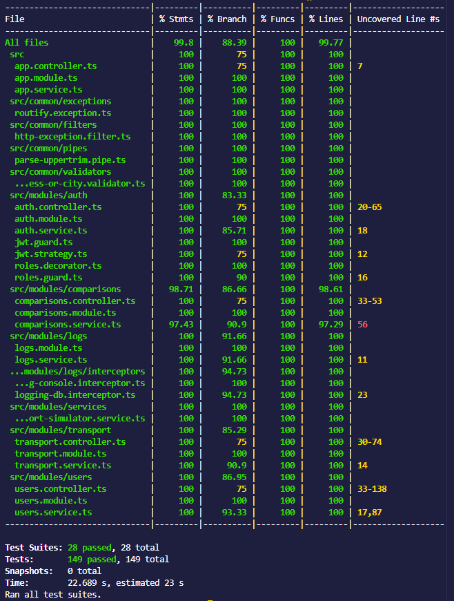

# Routify

A web app to compare all modes of transport in one place. RoutifyMD25 is a modular backend API built with NestJS, designed to support intelligent transportation systems. It provides secure authentication, user and route management, route comparisons, and persistent logging — all structured for scalability and maintainability.


# General description
This project is a RESTful API developed with NestJS and TypeORM, designed for create comparisons between multiple modes of transportation- such as car, bike, public trantis, and walking, and a based on route specific data. This API helps users make informed travel decisions by evalutaing time, cost and reliability across options. 

# Purpose:

Modern travel decisions are fragmented. Users juggles multiple apps and  sources to compare transport modes, often leading to slow and suboptimal choices, Routify solves this by offering a unified solution for multimodal route comparison, backed by a robust and modular backend. 

# Features

- JWT authentication with role-based access control
- User registration, login, and profile management
- Transport route creation, update, and retrieval
- Route comparison and history tracking
- Logging system with DB persistence
- Unit and integration tests with Jest + Supertest
- Modular NestJS architecture


# Tech Stack.

Layer               Technology
Backend             Nest JS
Database            TypeORM + MySQL
Auth                Passport + LWT  
Testing             Jest + Supertest
Documentation       Swagger

Requirements 
Nodejs 
MySQL
npm

# Instalation
 1. Clone the repository git clone:
    cd Routify

 2. Install dependencies:
    npm install

 3. Configure environment variables:
    Create a .env file in the root of the project
    Copy the contents of .env.example and adjust the values as needed.

 4. Database configuration:
    Run migrations - npm run typeorm migration:run

# Running the App:
    Development mode:
    npm run start:dev
    Production build:
    npm run build
    npm run start:prod

### Estructura del proyecto

```bash
Routify/
├── src/
│   ├── assets/       
│   ├── common/       
│   ├── dto/          
│   ├── entities/    
│   ├── interfaces/   
│   ├── migrations/     
│   └── modules/
│       ├── auth/
│       ├── comparisons/
│       ├── logs/
│       ├── services/
│       ├── transport/     
│       └── users/
├── test/
└── .env.example

## Endpoints de la API

### Autenticación
```
| Método | Endpoint            | Descripción                          | Protección     |
|--------|---------------------|--------------------------------------|----------------|
| POST   | `/auth/register`    | Registrar nuevo usuario              | Pública        |
| POST   | `/auth/login`       | Iniciar sesión y obtener JWT         | Pública        |

### Usuarios
| Método | Endpoint          | Descripción                          | Protección     |
|--------|-------------------|--------------------------------------|----------------|
| GET    | `/users`          | Listar todos los usuarios            | Solo Admin     |
| GET    | `/users/:id`      | Obtener usuario por ID               | Admin o propio |
| PATCH  | `/users/:id`      | Actualizar datos del usuario         | Admin o propio |
| DELETE | `/users/:id`      | Eliminar usuario                     | Solo Admin     |

### Rutas de Transporte
| Método | Endpoint              | Descripción                          | Protección     |
|--------|-----------------------|--------------------------------------|----------------|
| GET    | `/transport`          | Obtener todas las rutas              | Autenticado    |
| POST   | `/transport`          | Crear nueva ruta de transporte       | Autenticado    |
| GET    | `/transport/:id`      | Obtener una ruta específica          | Autenticado    |
| PATCH  | `/transport/:id`      | Actualizar ruta                      | Autenticado    |
| DELETE | `/transport/:id`      | Eliminar ruta                        | Autenticado    |

```

# Logs register



# Testing:
    npm run test
    npm run test:cov


